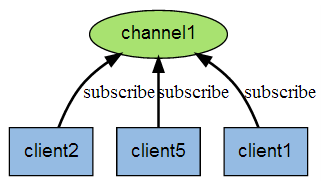
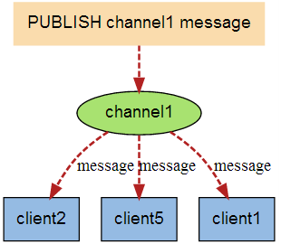

## Redis
`redis是开源、高级的键值存储的缓存数据库，Key-Value型，redis支持的2类型非常多，包括String(字符串)，list(列表)，set(集合)，zset(有序集合)，hash(哈希)等，可以取交集，
并集，差集等相关操作。这些操作都是原子性命令，redis是内存型数据库，redis会周期性的将数据保存在磁盘上或者追加到记录文件中，实现主从同步`

### 1. redis特点：
```bash
（1）支持内存存储

（2）支持持久化存储

（3）数据类型更加丰富

（4）支持主从集群，分布式

（5）支持队列等特殊功能
```
### 2.redis和Memecache对比
```bash
1.存储方式
  memecache把数据全部存储在内存中，断电即失，数据不能超过内存大小，redis会把部分数据持久化在磁盘上(RDB，AOF)

2.数据支持类型
  redis在数据支持上比memecache支持更多

3.使用底层模型不同
  redis构建自己VM机制，因为一般系统调用系统函数的话会浪费一定的时间去请求和移动
  
4.运行环境不同
  redis现在只支持linux环境，windows环境不在进行维护
```

### 3.安装redis
```bash
wget https://download.redis.io/releases/redis-6.2.1.tar.gz
tar xzf redis-6.2.1.tar.gz
cd redis-6.2.1
make
过程中可make编译失败，需要在linux终端执行以下命令
最新的redis6.0 需要gcc 5以上，先升级gcc 
sudo yum install centos-release-scl
sudo yum install devtoolset-7-gcc*
scl enable devtoolset-7 bash
make distclean清理以下然后再执行make
make 
```

### 4.redis启动
```bash
启动服务
redis-server redis.conf 
开启客户端
redis-cli -p 6380 
测试连接成功
ping
    
```

### 5.redis配置
```bash
查看配置
config get config_name
设置配置属性
config set config_name target
覆盖配置文件中的配置
redis-server 6389.conf --loglevel warning 
获取所有属性
config get *
常用配置说明 
#Redis默认不是已守护进程方式运行，可以通过配置修改，修改为yes,已守护进程修改
daemonize no 

pidfile /var/run/redis.pid
#Redis已守护进程的方式运行时，Redis默认会把pid写入/var/run/redis.pid文件，

port 6379
#指定redis端口为6379

bind 127.0.0.1
#绑定ip地址

timeout 300
#当客户端闲置300s关闭，0的话表示不关闭
    
loglevel notice
#指定日志级别 debug,verbose,notice,warning默认notice

logfile stdout
#日志记录方式，默认标准输出，

databases 16
#设置数据库的数量，默认数据库为0，可以使用SELECT 命令连接指定的数据id

save <seconds> <changes>
#指定多长时间，多少次操作将数据同步到数据文件中
save 900 1    900s更新1次
save 300 10   300s更新10次
save 60 10000 60s更新10000次

rdbcompression yes 
#指定存储数据是否压缩，默认为yes，Redis采用LZF压缩，为了节省CPU可以关闭，但是会造成数据过大

dbfilename dump.name 
#指定本地数据名称

dir ./
#指定本地文件存放的目录

slaveof <masterip> <masterport>
#当本机为从节点时，设置主节点的IP地址及端口，在Redis启动slave会从master同步

masterauth <master-password>
#当master设置了密码服务时，slave服务连接master的密码

requirepass foobared
#设置redis连接密码，如果配置了连接密码，客户端在连接Redis时，需要通过AUTH <password>命令提供密码

maxclients 128
#设置同一时间最大的客户端连接数，默认无限制如果maxclient 0表示不限制，当客户端连接数达到限制，
# Redis会关闭新的连接并向客户端返回max number of clients reached 信息

maxmemory <bytest>
#redis最大内存限制，Redis达到最大内存后Redis会尝试清除已经过期的或即将到期的key,此方法处理后仍然达到最大内存设置，
# 将无法再进行写入操作，但是仍然可以进行读操作，Redis新的vm机制，会把Key放到内存，Value会放在swap区

appendonly no
#指定是否在每次更新操作后进行日志操作，Redis在默认情况下是异步将数据存入磁盘，如果不开启，
# 可能在断电时导致导致一段时间内的数据丢失，redis本身同步是按照上面的slave条件来同步的所以数据一段时间内只存储在内存中
#默认为no

appendfilename appendonly.aof 
#指定更新日志文件名

appendfsync everysec 
#更新日志文件，共有三个值可以选择 no 等操作系统数据缓存同步 always：每一次更新后手动调用fsync()将数据写到磁盘
# everysec 表示每一秒同步一次

vm-enable no
#指定是否启用虚拟内存机制，默认为no,VM机制将数据分页存放，

vm-swap-file /tmp/redis.swap 
#虚拟文件路径不可多个redis共享实例

vm-max-memory 0
#将所有大于vm-max-memory的数据存入虚拟内存，无论vm-max-memory 设置多小，所有索引存储都是内存存储的当vm-max-memory为0时，
# 其实所有的value 都存储在磁盘上

vm-page-size 32
#swap文件分成了多个page,一个对象可以保存在多个page上，，但是一个page不能被多个对象共享，

vm-paages 123213123
#设置swap文件中的page数量，由于页表是放在内存中，磁盘上每8个pages将消耗1byte的内存

vm-max-threads 4
#设置访问swap的线程数

```
### 5.redis数据类型
String ,List ,Hash ,Set ,Zset五中数据类型
```bash
列表 集最多可以存储2^32-1个数据约40亿，String key最大为512M,String是二进制安全的，可以存储任何数据
```
| 类型 | 右对齐标题 | 场景 |
| :------| ------: | :------: |
| String | 二进制安全 | 分布式锁 |
| Hash | 键值对集合 | 存储，读取，修改用户属性 |
| List | 双向链表 | 消息队列，最新消息排行 |
| Set | hash实现，不重复 | 共同好友，访问某一网站的独立IP,共同好友推荐 |
| Zset | 有序集合 | 排行榜，带权重的消息队列 |

### 6.Redis key命令

```bash
del key
key存在时删除key

dunp key
序列化给定key,并返回序列化的值

exists key
检查给定的key是否存在

expire key seconds
给key设置过期时间

exporeat key timestamp
设置过期时间，expireat 命令参数是UNIX的时间戳

pexpire key millseconds
设置key的过期时间以毫秒记

pexpireat key millseconds-timestamp
设置key的过期时间时间戳以毫秒记

keys pattern 
查找所有给定模式的key

move key db
将key移动到某一个db中

persist key 
移除key的过期时间，key将永远保持

pttl key 
已毫秒给单位返回key剩余的过期时间

ttl key 
已秒为单位返回key剩余的过期时间

randomkey key 
从当前数据库中随机返回key

rename key newkey
将key的名字设置为newkey

renamenx key newkey
当newkey不存在时将key名字修改为newkey

type key
返回键的类型


```
### 7.Redis String类型

```bash
Set key value 
设定key的值

Get key
获取key的值

GetRange key start end
返回key中字符串值的子字符

GetSet key value
将指定的key设置为value，并返回key的旧值

GetBit key offset 
对key存储的字符串，获取指定偏移量上的位

SetBit key offset
设置或指定key偏移量上的位

SetNx key value (redis用作分布式锁)
只有key不存在的才能设置key为value

SetRange key offset value
用value参数复写key所存储的字符串值，从偏移量开始

Strlen key
返回key的长度

Mset key value[key value]
可以设置多个key和value

MSetNx key value[key value]
当多个key不存在的时候设置key value

Psetex key milliseconds value
毫秒为单位设置key的生存时间，不像setex以秒为单位设置key的生存时间

Incr key
key中存储的值+1

IncrBy key increment
将key所存储的值+increment

IncrByFloat key increment
将key所存储的值+浮点数increment

Decr key
将key所存储的值-1

DecrBy key decrement;
将key所存储的值-increment

Append key value
将key所存储的值末尾追加value


```
### 8.Redis Hash类型
hash可以存储2^32-1键值对
```bash
Hdel key field[field2]
删除一个或多个哈希值

Hexists key field
key中是否存在field

HgetAll key 
获取哈希表中指定key的所有字段和值

Hincrby key field increment
为哈希key field添加increment

IincrbyFloat key field increment
为哈希key field添加浮点数increment

hkeys key
获取所有哈希表中的字段

hlen key 
获取key中字段的数量

HMget key field[field2]
同时获得多个给定字段的值

HMset key field value [field2 value2]
将多个key中field-value 设置到hash中

HSet key field value
将key field 设置为value

HsetNx key field value
没有key的时候能设置field value

Hvals key
获取哈希表中所有的值

Hscan key cursor[Match pattern][Count count]
迭代哈希表中键值对

```
### 9.Redis List类型
可以添加一个元素到列表的头部或者尾部，一个列表最多含2^32-1个元素
```bash
BlPop
移除并获取列表的第一个元素，如果列表中没有元素会阻塞，直到等待超时或者发现有元素可以弹出为止

BRPop
移除并获取最后一个元素，如果列表没有元素会阻塞直到等待超时或者发现可以弹出元素为止

BRPopLPush source destination
从列表尾部弹出一个值，并且再另一个列表头部插入

Lindex key index
通过索引获取列表中的元素

LLen key 
获取列表的长度

Lpop key
从头部弹出元素

RPop key
从尾部弹出元素

Lpush key value1
从头部插入元素value1

Rpush key value
从尾部插入元素value

Lpushx key value1
将一个值插入已存在列表的头部

Lrange key start end
获取列表指定范围的元素

Lrem key count value  
移除列表指定位置的元素

LSet key index value
通过索引设置列表中的index位置的值

Ltrim key start stop 
对列表进行修剪，让列表只保留指定区域内的元素，不在指定区域内的元素都将被删除

RPopLpush source destination
从列表source尾部弹出元素再列表destination头部插入元素

RPushx key value
为已存在的列表添加值

```
### 10.Redis Set类型
无序集合，意味着集合不能出现重复数据，Redis通过hash表实现，插入和删除的时间复杂度都是O(1)
最大元素数：2^32-1
```bash
Sadd key member
向集合中添加一个或多个member

Scard key 
获取集合的成员数

SDiff key1 [key2]
获取第一个集合和其他集合的差异

SDiffStore destination key1 [key2]
返回指定集合差集存储在destination中

SInter key1 [key2]
返回指定集合的交集

SInterStore destination key1[key2]
返回指定集合的交集并存储在destination中

Sismember key member 
判断member是否时key的成员

Smove key destination member 
将集合中成员member移动到destination中

Spop key
移除key

SRangeMember key
返回集合中一个或者多个成员

Sunion key1 [key2]
返回所有指定集合的并集

SunionStore destination key1[key2]
返回所有指定集合的并集存储在destination中

SScan key cursor [Match pattern][Count count]
迭代集合中的元素


```
### 11.Redis Sorted Set类型
通过哈希表实现，插入和删除的时间复杂度为O(1),最大成员数量2^32-1个元素

```bash
Zadd key score1 member1[score2 member2]
向有序集合中添加成员member1

Zcard key 
获取有序集合的成员数

Zcount key min max
计算指定区间分数的成员数

ZIncrBy key increment member
有序集合中对指定成员的分数上加增量increment

ZInterStore destination numberkeys key 
计算给定的一个或多个有序集的交集并将结果存到新的有序集合中

ZLexCount key min max
指定区间内成员数

Zrange key start stop
返回有序集合start到stop所有成员

ZrangeByLex key min max
通过字典区间返回有序集合成员

ZRangeScore key min max
通过分数返回有序集合的指定区间内的成员

ZRank key member
返回有序集合指定成员的索引

Zrem key member 
移除集合中一个或多个成员

ZremRangeByLex key min max 
移除指定区间内的所有成员

ZremRangeByRank key start stop
移除指定排名的区间内的所有成员

ZremRangeByScore key min max
移除有序集合指定分数区间内的所有成员

ZRevRange key start stop
返回有序集合指定区间的成员，通过索引分数从高到低排列

ZRevRangeByScore key min max
返回有序集合指定区间，分数从高到底排列

ZRevRank key member 
返回有序集合指定成员排名，分数递减排名

Zscore key member 
返回有序集合成员分数

ZunionStore destination numberkeys[key]
指定一个或者多个集合的并集

Zscan key cursor [match Pattern] [Count count]
迭代有序集合中的元素


```
### 12.Redis HyperLoglog类型
基数类型，不同元素的个数
```bash
PFadd key element
添加元素到key中

PFCount key 
返回给定HyperLoglog基数估计值

PFMerge destkey sourcekey
将多个HyperLogLog合并为一个HyperLoglog
```
### 13.Redis 发布订阅
订阅：



发布：



```bash
PSubscribe pattern[pattern] 
订阅一个或者多个给定模式的频道

PubSub subcommond[argument]
查看订阅发布系统状态

Publish channel message
发布消息

PunSubScribe[pattern]
推定所有给定模式的的频道

SubScribe channel [channels]
订阅一个或多个频道的信息

UnSubscribe channel
退订给定频道

```
### 14.Redis 事务
一次可以执行多个事务，但是事务不是原子性
事务经历三个阶段：
（1）开启事务
（2）命令入队
（3）执行事务

```bash
Multi
开启事务

Discard
丢弃事务

Exec
执行事务

UnWatch
取消Watch命令对所有key的监视

Watch key[key]
监视一个key或者多个key

```
### 15.Redis 脚本
Redis可以执行Lua脚本，命令为Eval
```bash
Eval script numberkeys key[key] arg[arg]
执行Lua脚本

EvalSha sha1 numberkeys key[key] arg[arg]
执行Lua脚本

ScriptExists script[script]
查看脚本是否存在缓存中

ScriptFlush 
从缓存中移除所有脚本

Script kill
杀死当前正在运行的脚本

ScriptLoad script
将脚本加到缓存中并不立即执行这个脚本

```
### 16.Redis 连接
```bash
AUTH password
验证密码是否正确

Echo message
打印字符串

PING
能否ping通redis服务器

Quit
退出当前连接

SELECT Index
切换到指定数据源
```
### 17.Redis 服务器
Info可以查看redis服务器信息
```bash
BGRewriteAOF
异步执行一个AOF文件重写操作

BGsave
异步保存数据库的数据到磁盘

Client kill [ip][port]
客户端关闭ip和端口

Client list
获取连接服务器的列表

Client GetName
获取连接的名称

Client SetName
设置当前连接名称

Client Pause timeout
在指定时间终止运行客户端的命令

Cluster slots
获取集群节点映射数组

Command
获取Redis命令

Command Count
获取redis命令总数

Command getKeys
获取给定命令的所有键

Time
获取当前服务器的时间

Command info command-name
指定redis命令描述的数组

Config get parameter
获取指定配置文件的值

Config rewrite
对启动redis的redis.config配置文件进行修改

Config set Parameter value
修改redis配置参数，无需修改

Config ReserStat
重置info命令中的某些统计数据

Dbsize
返回当前数据库的key数量

Debug Object key
获取key的调试信息

Debug SegFault
让redis服务器崩溃

FlushAll
删除所有的key

FlushDB
删除当前数据所有的key

LastSave
最后一次将redis成功保存到磁盘上的时间

Monitor
实时打印出redis服务器接收的命令，调试使用

Role
返回主从实例所属角色

Save
同步保存数据库到磁盘

ShutDown
异步保存数据库到磁盘并关闭服务器

SlaveOf host port
当前服务器变为服务器的从属服务器

SlowLog subcommond [argument]
管理redis的慢日志

sync
用于复制功能的内部命令

```


### 18.Redis GEO操作


